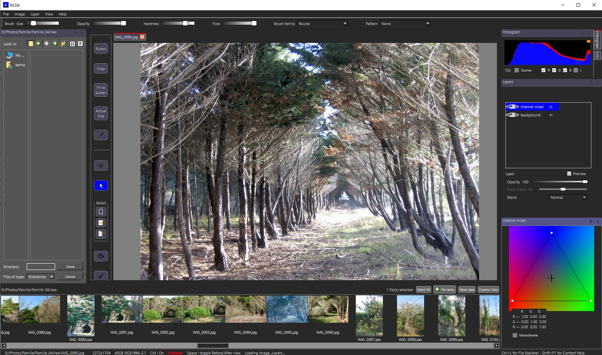

This File is part of bLUe software.

Copyright (C) 2017-2025 Bernard Virot

## NEW
bLUe can use Gemini's conversational image segmentation to select objects in an image.

## DESCRIPTION

bLUe is a layer-based image editor. It aims to integrate a new *perceptual 3D LUT editor* with more traditional tools to provide a powerful GUI for photo editing. The program is fully modular : tools are implemented as independent
adjustment layers using a common GUI. New features can be added easily:
any imaging library exposing Python bindings can take advantage of the GUI.

bLUe can develop raw images in all usual formats : nef, cr2, arw, dng, ... It supports dng/dcp dual illuminant camera
profiles : they are essential for rendering colors similar to that produced by camera software.

bLUe provides drawing layers and paint brushes with adjustable parameters: size, flow, hardness, opacity.

bLUe is aware of multiscreen environments and color profiles : it uses image and monitor profiles in conjunction to
display accurate colors.

bLUe uses a pretrained neural network to provide automatic 3D LUTs for fast enhancement of images. The pretrained model
and the code are taken from the [recent work](https://github.com/HuiZeng/Image-Adaptive-3DLUT) of Hui Zeng, Jianrui Cai,
Lida Li, Zisheng Cao, and Lei Zhang.

Images being edited and their layer stack can be saved to .blu file format.

The program is written in Python.

### THE PERCEPTUAL 3D LUT EDITOR

A 3D LUT is a table representing a 3D cube of color nodes. Image pixels are associated with nodes, according to their
color. Changes are applied to each node individually, giving full control over colors.

3D LUTs are edited in a *perceptual editor* by selecting, grouping and moving color nodes over a hue-saturation color
wheel. Nodes are bound to an elastic grid and a grid smoothing algorithm is provided to even changes in color.

##### GROUPING NODES

A group of nodes represents a *meaning* region of an image, for example : tree leaves, skin, hairs, water, blue sky,
...), and all nodes in a group should be edited in a similar way.

The editor's workflow is based on the grouping of nodes.

* Nodes are selected and grouped from the image;

* To edit the colors of all pixels in a group while keeping their brightnesses, simply move the group on the color
  wheel;

* To control the brightnesses of pixels in a group, edit the brightness curve of the group.

##### CHANGING THE GAMUT

The whole grid can be warped to produce a particular look (orange-teal, moonlight, ...)

##### COMPLETING THE 3D LUT

Color transformations such as RGB curves, channel mixing, temperature,... can be easily integrated in the 3D LUT, in any
order, by adding the corresponding adjustment layers to the stack and recording the whole stack as a single 3D LUT.
An [example 3D LUT](http://bernard.virot.free.fr/sunrise.cube) can be found on the web site.

## WEB SITE

See the [bLUe site](http://bernard.virot.free.fr/) for screenshots, tutorials and user manual.

## FUNCTIONALITY

* Conversational image segmentation
* Neural-network-based automatic 3D LUT for image enhancement
* Soft proofing
* Simultaneous edition of multiple images in formats jpg, heic, png, tif, nef, cr2, arw, dng,...
* Color profile management
* Adjustment layers : exposure, brightness, saturation, contrast, channel mixer, color temperature,
  inversion, filters, color grading. 
* noise reduction, seamless cloning, segmentation, exposure fusion, curves, 2.5D LUTs, 3D LUTs.
* Drawing and painting layers; tablet support
* Extensible set of brushes and patterns; .abr files support
* Automatic contrast enhancement (histogram warping and CLAHE)
* Seamless cloning
* Exposure fusion
* Multiple blending modes; adjustable layer opacity
* Import and export of 3D LUTs in .cube format
* Editable masks
* Automatic import of camera specific profiles for development of raw images
* Built-in file explorer
* Slide show
* Context-sensitive help

## REQUIREMENTS

* Python >= 3.9
* Qt6 for Python (PySide6)
* opencv-python
* numpy
* Pillow
* RawPy
* PyWavelets
* PyTorch >= 1.4 and torchvision for auto adaptive 3D LUT
* tifffile
* google-genai for conversational image segmentation

ExifTool should be installed.

On Windows, pywin32 is needed for multiscreen management.

On Ubuntu, gi and colord are needed to manage monitor profiles.

On MacOS, pyobjc is needed to use the ColorSync framework.

## Installation
Edit config_win.json (Windows) or config.json (other OS) to specify
system paths and options. 

#### The Qt5 (PySide2) version (branch master) is deprecated.

## LICENSE

 This project is licensed under the LGPL V 3.


# bLUe: An Extensible 3D LUT Editor

Author: [Bernard Virot](https://github.com/bvirxx/bLUe_PYSIDE)

# Abstract

The "bLUe" editor is a Python-based platform designed to simplify the 
development and testing of image processing techniques. Leveraging PySide6 
for GUI construction and Numpy for computational tasks, it provides a modular, 
layer-based architecture that enables real-time parameter adjustments 
and seamless integration with Python-compatible image libraries. 
With features like stackable layers, advanced color management, 
and an intuitive GUI, "bLUe" facilitates both professional and experimental 
workflows for image editing. Its extensibility allows users to incorporate 
new image processing techniques with ease, making it a robust tool for 
developers and researchers alike.

# Introduction

"bLUe" is a powerful editor for 3D LUT (Look-Up Table) 
manipulation, designed to bridge the gap between advanced 
image processing and user-friendly interfaces. 
Built on Python technologies such as PySide6 and Numpy, 
the platform offers a modular, extensible framework 
that supports Python-compatible libraries. 
By allowing real-time visualization of adjustments, "bLUe" 
enhances user productivity and enables rapid experimentation with 
image processing workflows.

# Key Features

### Modular Architecture with Layer Stack

> "bLUe" employs a layer-based processing system. Each layer represents a
processing step : it processes an 
input image, and stores the output image. A layer can be visible or hidden. 
Each layer holds an opacity value, a blending mode, and a mask.
Several layers can be stacked. 
They act as a pipeline, computing the final image by blending the visible layers, 
from bottom to top.

A _background layer_, holding the initial image, is added at the 
bottom of the stack, and all layers must be the same size.

For large-scale images or computationally intensive tasks, 
a preview mode speeds up processing without compromising the workflow.

### Intuitive GUI


> The GUI is designed for seamless interaction with processing parameters. 
Each layer has a dedicated view that reflects real-time changes, 
ensuring immediate feedback. The platform’s user-friendly interface 
is built with Qt for Python (PySide6), offering features like contextual
help for accessibility.

### Flexible Data Structures

The editor’s core data structures include:

* _bImage:_ Extends QImage to handle image processing workflows.
<!-- -->
* _QLayer:_ Represents a processing layer, inheriting from QImage and providing 
transformation methods.
<!-- -->
*  _baseForm and baseGraphicsForm:_ Simplify GUI interactions, 
supporting standard widgets and graphical elements, respectively.
<!-- -->
* _imImage:_ Extends bImage to handle the stack of processing layers.

The following UML diagram illustrates the relationship between these classes:

```mermaid
classDiagram
    class `imImage`
    imImage: layersStack
    class `bImage`
    class `baseForm`
    class baseGraphicsForm
    class `QLayer`
    QLayer: execute
    QLayer: rPixmap
    QLayer: parentImage
    QLayer: getGraphicsForm()
     QLayer: getCurrentImage()
    QLayer: getCurrentMaskedImage()
    QLayer: inputImg()
    `bImage` --> `QLayer`
    `bImage` --> `imImage`
    
    
````

# Code Example

The following Python code snippet illustrates how layers are blended to 
produce the final output image:

    def getCurrentMaskedImage(self):
        """
        
        Blend the layer stack up to the current layer (included), considering 
        blending modes, opacities and masks.
    
        :return: Blended image
        :rtype: bImage
        """
        # Initialization
        if self.maskedThumbContainer is None:
            self.maskedThumbContainer = bImage.fromImage(self.getThumb(), parentImage=self.parentImage)
        # Reset container
        img = self.maskedThumbContainer
        img.fill(QColor(0, 0, 0, 0))
        # Blend layers
        qp = QPainter(img)
        for layer in self.parentImage.layersStack[:self.stackIndex + 1]:
            if layer.visible:
                qp.setOpacity(layer.opacity)
                qp.drawPixmap(QRect(0, 0, img.width(), img.height()), layer.rPixmap)
        qp.end()
        return img

This approach ensures efficiency by maintaining containers that are instantiated 
only once and updated dynamically.

## Adding New Processing Techniques
Adding a new technique involves three steps:

### 1. Design the GUI
Create a form for user interaction, leveraging existing forms as templates. 
For example, use [graphicsFormAuto3DLUT](https://github.com/bvirxx/bLUe_PYSIDE/blob/pyside6/bLUeTop/graphicsAutoLUT3D.py).

Input items like sliders and checkboxes can be customized as needed.

 >- Add items to the form attributes :

        self.slider1 = QbLUeSlider(Qt.Orientation.Horizontal)
        ...

>- For each item, connect the signal indicating that a new state or a new value 
is available to self.dataChanged :
    
        for s in sliders:
                        s.sliderReleased.connect(self.dataChanged)
 
**Note**. To be able to save and restore their state, input item classes 
must override the methods
\__getstate()__ and \__setstate()__. 

### 2. Implement the Processing Logic
Define the transformation function in the QLayer class (or a subclass). 
For example, the following function
builds  a 3D LUT for automatic image enhancement. It uses
three user-defined parameters for testing purpose. 


    def applyAuto3DLUT(self):

        # Get the user interface
        
        ui = self.getGraphicsForm()

        # Generate an automatic 3D LUT, applying three correction coefficients.
        
        coeffs = [ui.slider1.value(), ui.slider2.value(), ui.slider3.value()]
        lutarray = generateLUTfromQImage(self.inputImg(), coeffs)
        
        # Interpolate the input image with LUT
        
        interp = chosenInterp()
        outputArray = interp(lutarray, self.inputImg())  
        
        # Copy outputArray to the image data buffer (alpha channel excluded)

        QImageBuffer(self.getCurrentImage())[..., :3] = outputArray

        # Convert the image to QPixmap.
        
        self.updatePixmap()

### 3. Integrate into the main Menu

Add the new functionality as an action in the menu _Layer_:

    elif name == 'actionAuto_3D_LUT':
        layer = window.label.img.addAdjustmentLayer(role='AutoLUT')
        layer.execute = lambda: layer.tLayer.applyAuto3DLUT()

## Color Management

A dedicated class (_QPresentationLayer_) handles advanced color management. 
It enables compatibility with image and monitor profiles, 
ensuring accurate color rendering. 

## Conclusion

The "bLUe" editor offers a cutting-edge environment for developing 
and testing image processing techniques. 
Its modular design, real-time visualization, 
and seamless extensibility make it a powerful tool for both 
developers and researchers.
